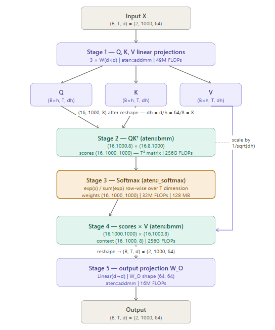

FOR KERNEL 2: SELFATTENTION

### Constants used in the conformer model

B = Batch size = 2  
T = sequence length = 1000  
d = model dimension = 64  
h = head = 8

Based on data flow there are 5 stages to this kernel 

### To calculate FLOPs across the 5 stages of the kernel

**Stage 1:**  

Q, K, V projections - 3 projections -  hence multiplied by 3  
Output matrix dimension - (B, T, d)  

Q, K, V Projections = 3 \* (2\*B\*T\*d\*d)  
                    = 3 \* (2\*2\*1000\*64\*64)                   
                    = 49,152,000

**Stage 2:**  

QKT bmm (batched matrix multiply) - scores for Q and K - hence multiplied by 2  
Q matrix dimension              -  (B\*h, T,   d/h)  
KT matrix dimension  -  (B\*h, d/h, T)  
Output matrix dimension         -  (B\*h, T,   T)

QKT score = 2 \* (B\*h \* T \* d/h \* T)  
                     = 2 \* (2\*8 \* 1000 \* 64/8 \* 1000)                                           
                     = 256,000,000,000     

**Stage 3:**

Softmax score = exp(x_i) / sum (exp(x_1), exp(x_2),....exp(x_T))

This function computes exponent of each element, sum of the the exponent values and divided each each element by the sum. Thus, 2 FLOPs are needed - 1 for exponent and 1 for division. Summation is considered minor in comparision and hence dropped. Hence, the softmax score is multiplied by 2.  
Input and Output matrix dimesion - (B\*h, T, T)  

Softmax score = 2 \* (B\*h \* T \* T)  
              = 2 \* (2\*8 \* 1000 \* 1000)                
              = 32,000,000

**Stage 4:**

Scores * V bmm (batched matrix multiply) - previous scores * V - hence multiplied by 2  
previous score from softmax output dimension - (B\*h, T, T)  
V matrix dimension                           - (B\*h, T, d/h)  
Output matrix dimension                      - (B\*h, T, d/h)  

score = 2 \* (B\*h \* T \* d/h \* T)  
      = 2 \* (2\*8 \* 1000 \* 64/8 \* 1000)             
      = 256,000,000,000

**Stage 5:**

Input and Output matrix dimension - (B, T, d)  
Linear transformation - d  

Output projection = 2 \* (B\*T\*d)\*d  
                  = 2 \* (2\*1000\*64)\*64                    
                  = 16,384,000

### TOTAL FLOPs
            = Stage1     + Stage2          + Stage3     + Stage4          + Stage5  
            = 49,152,000 + 256,000,000,000 + 32,000,000 + 256,000,000,000 + 16,384,000              
            = 512,097,536,000

-----------------------------------------------------------------------------------------------------

### To calculate memory transfer across the 5 stages of the kernel

Assuming FP32 (4bytes/elemnt), no cache reuse

**Stage 1:**

For Q, K, V Projections - 3 is multiplied to the calculation  
Weight matrix - d\*d  
Input and Output matrix dimensions (B, T, d)  

Attention projections (in bytes) = 3 \* (d\*d + B\*T\*d + B\*T\*d) * 4  
                                 = 3 \* (64\*64 + 2\*1000\*64 + 2\*1000\*64) * 4                                
                                 = 3,121,152

**Stage 2:**

QKT:  
Q matrix dimension              -  (B\*h, T,   d/h)  
KT matrix dimension  -  (B\*h, d/h, T)  
Output matrix dimension         -  (B\*h, T,   T)

QKT score (in bytes) = (B\*h\*T\*d/h + B\*h\*d/h\*T + B\*h\*T\*T) \* 4  
                                = (2\*8\*1000\*64/8 + 2\*8\*64/8\*1000 + 2\*8\*1000*1000) \* 4                                
                                = 65,024,000

**Stage 3:**

Softmax - Input and Output matrix dimesion - (B\*h, T, T)  
Softmax score (in bytes) = (B\*h\*T*T + B\*h\*T\*T) \* 4  
                         = (2\*8\*1000\*1000 + 2\*8\*1000\*1000) \* 4                           
                         = 128,000,000

**Stage 4:**

Scores * V bmm:  
previous score from softmax output dimension - (B\*h, T, T)  
V matrix dimension                           - (B\*h, T, d/h)  
Output matrix dimension                      - (B\*h, T, d/h)  

score (in bytes) = (B\*h\*T\*T + B\*h\*T\*d/h + B\*h\*T\*d/h) \* 4  
                 = (2\*8\*1000\*1000 + 2\*8\*1000\*64/8 + 2\*8\*1000*64/8) \* 4                   
                 = 65,024,000

**Stage 5:**

Output projections:  
Weight matrix - d*d  
Input and Output matrix dimension - (B, T, d)

output projection (in bytes) = (d\*d + B\*T\*d  B\*T\*d) \* 4  
                             = (64*64 + 2\*1000\*64 + 2\*1000\*64) \* 4                               
                             = 1,040,384

### TOTAL MEMORY 
             = Stage1    + Stage2     + Stage3      + Stage4     + Stage5  
             = 3,121,152 + 65,024,000 + 128,000,000 + 65,024,000 + 1,040,384               
             = 262,209,536

-----------------------------------------------------------------------------------------------------

### Airthmetic Intensity 
                     = TOTAL FLOPs / TOTAL MEMORY  
                     = 512,097,536,000 / 262,209,536                       
                     = 1953.001 FLOPs/byte

                     
