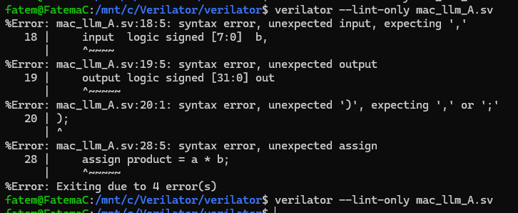
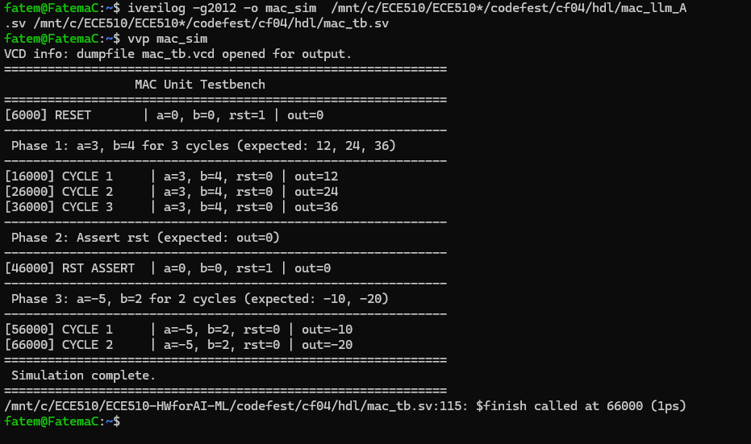
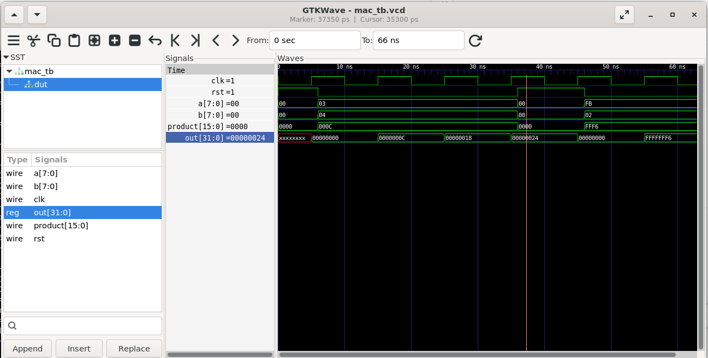
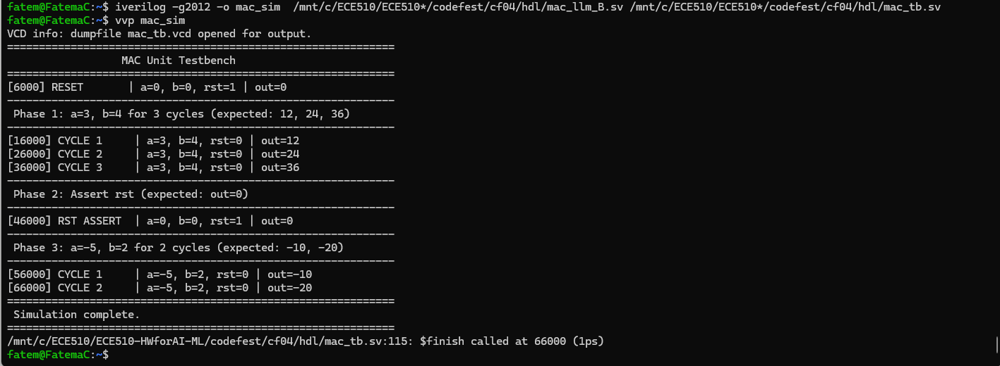
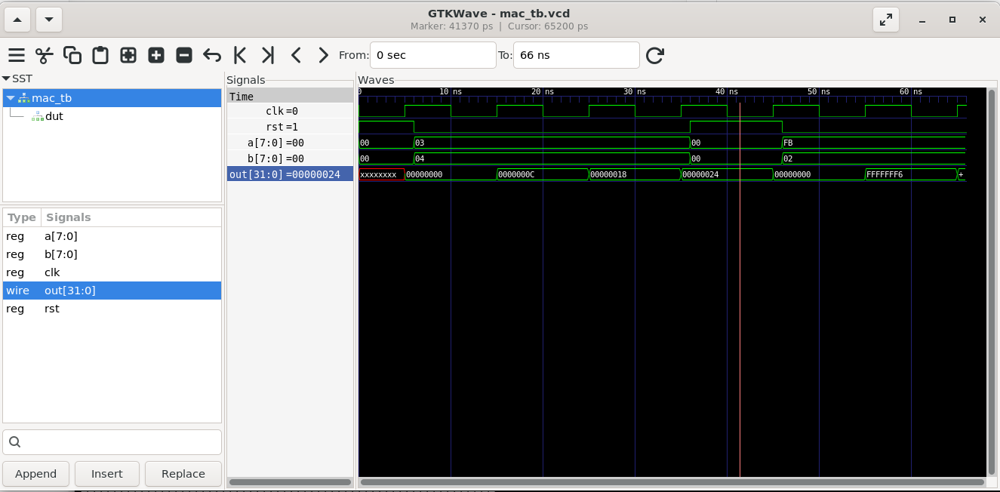
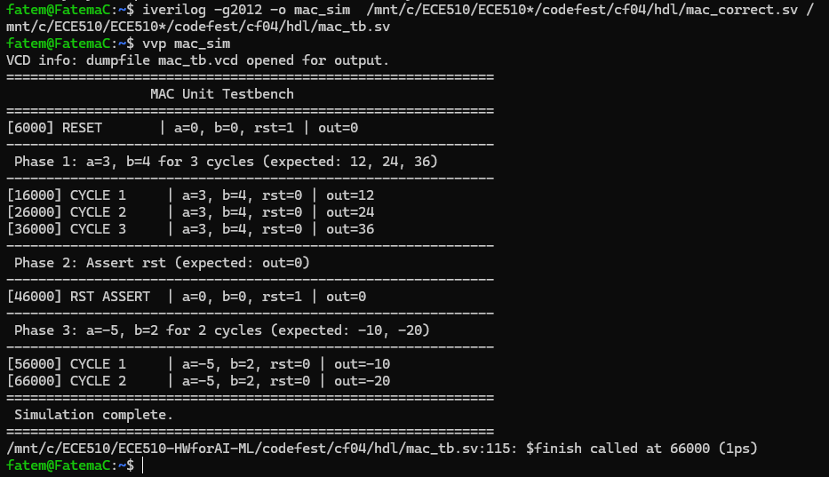
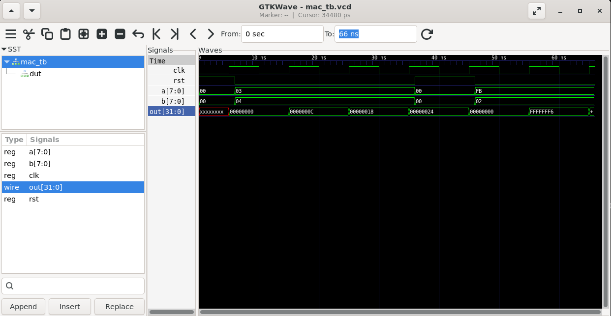
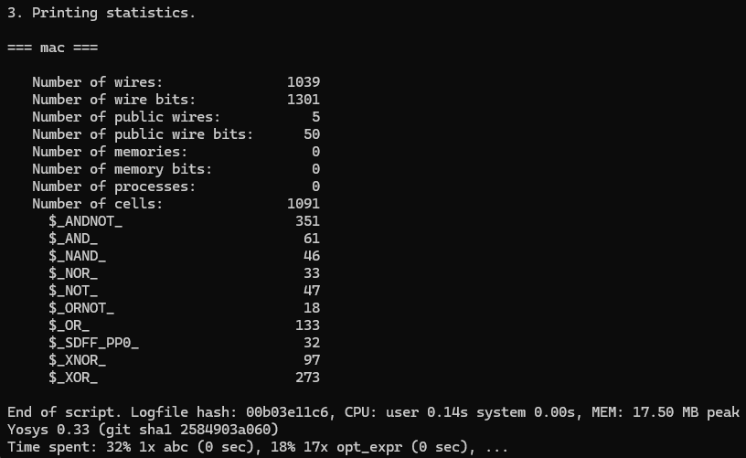

# Review

**mac_llm_A.sv:** This file was generated by Claude Sonnet 4.6    
**mac_llm_B.sv:** This file was generated by Gemini 3 Flash

**Compiling both of the above files with verilator:**  
Instruction:   &nbsp;&nbsp;    
&nbsp;&nbsp;&nbsp;&nbsp;    verilator --lint-only mac_llm_A.sv  
&nbsp;&nbsp;&nbsp;&nbsp;    verilator --lint-only mac_llm_B.sv  
Both files compile with no errors.   

And just to check, I removed a comma from mac_llm_A.sv file at line 17(input  logic signed [7:0]  a **,**   // 8-bit signed input A) and then recompiled the .sv file. This time I was able to see errors on the output as seen below.   

## Comparing the two files generated by LLMs and compiled using verilator
Both the files compiled fine with no error. But there were slight differences in the code as seen in the table below.
|                                                                                             | LLM_A = Claude                      | LLM_B = Gemini             | Explination                                                                                                                                                                                                     |
|---------------------------------------------------------------------------------------------|-------------------------------------|----------------------------|-----------------------------------------------------------------------------------------------------------------------------------------------------------------------------------------------------------------|
| Inside the Synchronous rst block when **rst=1** where **out** signal is defined | out <= '0;                          | out <= 32'sd0;             | '0     fills the entire width of **out** signal regardless of how wide it is to 0, matches the target signal width.   32'sd0 explicitly assigns 32-bits a signed decimal zero value (d indicates the value is in the base 10). Both methods are correct, however in my opinion, LLM_A - Claude is safer. If the width of out needs to be changed to 64-bits, for LLM_A the width only needs to be changed where variable is declared. But in LLM_B, the width needs to changed in its decleration and inside the if block. |
| Inside the else block when **rst=0** where **out** signal is defined  | out <= out + 32'(signed'(product)); | out <= out + 32'(product); | 32'(signed'(product)) - explicitly assigns product as a signed number and increases its width from 16 to 32.  32'(product) - in LLM_B only increases its width from 16 to 32 bits but does not explicitly say its a signed variable. Although both methods are correct as **product** was created as a 16 bit signed variable of logic type. Both methods give correct results, however in my opinion, LLM_A - Claude in the long run would be more readable and safer than LLM_B - Gemini                                                                                                                                                                                                          |

## Simulation with Testbench for LLM_A and LLM_B using iverilog
Changed to iverilog as verilator needs a C++ testbench. 
### LLM_A - Claude
Below are the outputs and the wave simulation using gtkwave  

  

### LLM_B - Gemini
Below are the outputs and the wave simulation using gtkwave  

  

## Compiling and running the mac_correct.sv using iverilog
Below are the outputs and the wave simulation using gtkwave  

  

## Compiling and running the mac_correct.sv using yosys

**mac_correct.sv file = mac_llm_A.sv**  
Below is the output for yosys. The output file for yosys is also provided under the review folder of cf04 as yosys_output.txt  
Number of public wires = 5 (clk, rst, a, b, out)  
Number of public wire bits = 50 (clk-1, rst-1, a-8, b-8, out-32)  

  