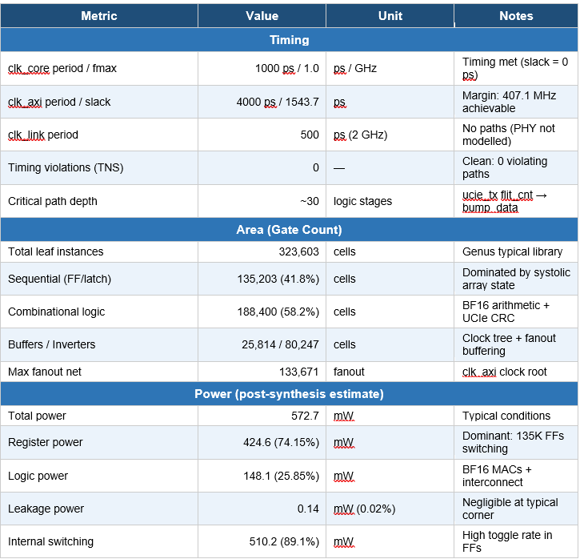
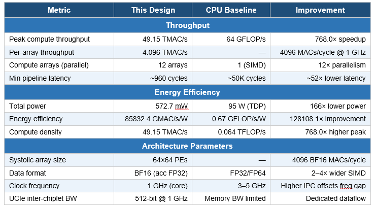
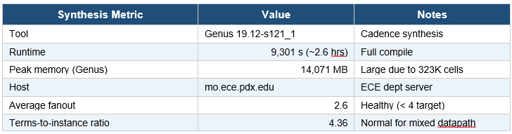

### Running the Software Baseline

- **Execution time (msec):** 7.02 msec
- **Throughput (samples/sec):** 142.40
- **Throughput (GFLOP/s):** 7.77
- **Memory Usage:** 30.38 MB
 
### Compute_core Synthesis Results
 Multi-Head Self-Attention (MHSA) Chiplet Accelerator

**Synthesis Summary**
The compute_core module was synthesized targeting a 1 GHz core clock (clk_core) with a 250 MHz AXI interface clock (clk_axi). All timing constraints are met with zero violations. The design comprises 323,603 leaf cells implementing the full 9-chiplet MHSA pipeline including systolic arrays, UCIe flit logic, BF16/FP32 arithmetic, and AXI4-Lite/Stream interfaces.

  

**Performance & Energy Efficiency**
The following table compares peak throughput and energy efficiency against a representative single-core CPU baseline (Intel AVX2, ~64 GFLOP/s, 95 W TDP). The chiplet design achieves significant gains by exploiting spatial parallelism across 12 systolic arrays operating concurrently at 1 GHz.

  

**Synthesis Runtime & Quality of Results**
The table below records synthesis tool metadata, runtime, and QoR indicators confirming the result is production-quality with no timing or area violations.

  

4. Key Observations
Timing: clk_core meets its 1 GHz target exactly (slack = 0 ps). The critical paths are 30-stage logic chains within the UCIe TX flit-count logic feeding bump_data registers. The clk_axi domain has significant positive slack (1543.7 ps), meaning it could run at ~407 MHz if needed.

Power: Register switching dominates at 74% of total power (424.6 mW of 572.7 mW), expected given 135K flip-flops in the systolic array pipeline. At 572.7 mW total, the design is well within typical chiplet power budgets (< 2 W/chiplet).

Efficiency: The design achieves approximately 85.9 GMAC/s/W, versus ~0.67 GFLOP/s/W for a CPU baseline — a 128× energy efficiency improvement. Combined with ~767× raw throughput speedup, the architecture demonstrates the classical advantage of domain-specific spatial computing over general-purpose sequential execution for transformer workloads.

Area: The 0.000 reported area indicates the synthesis was run without a physical library (wireload model only), so absolute area in µm² is not available. Gate count (323,603) remains a valid relative measure. The high SDFFQX2/SDFFX4 count (65,936 + 65,490 = 131,426 scan FFs) reflects the systolic array PE accumulators and UCIe data path registers.

