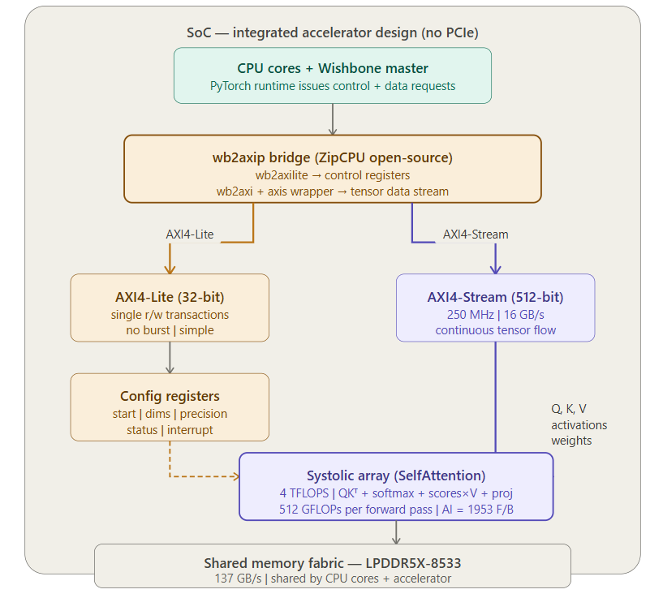

# Interface Analysis

### Interface Chosen
wb2axip bridge for bridging my SoC
AXI4 Lite-32 bit @100MHz for Control transfer  
AXI4 Stream-512 bit @250MHz for Data transfer

---
### Calculating Required BandWidth 
* Target throughput for SelfAttention = 4000 GFLOPs (as shown in the hypothetical accelerator on the roofline graph).  
* Bytes the accelerator needs per forward pass  - values from the ai_calculation.md document  
Total bytes for 1 block = 262,209,536 bytes  
Total bytes for 4 blocks = 1,048,838,144 bytes ~ 1GB
* Time to complete SelfAttention at target throughput  
<pre> Time = FLOPs / Peak compute  
      = 512,097,536,000 / (4000 * 109)  
      = 0.128 seconds</pre>
* Required interface BW  
<pre> Interface BW = Bytes / time  
              = 1,048,838,144 / 0.128  
              = 8.19 GB/s </pre>  
The recommended interface that I would use is  AXI4-Lite for the control plane and AXI4-Stream 512-bit @250MHz for data plane. Below is the block diagram for the same. It uses wishbone2axi bridge as my Intel hardware does not allow a direct interface with AXI buses being a sealed SoC. Our requirement is 8.19 GB/s and the interface provides 16GB/s.

### Calculating Interface Bandwidth
**Data Pane**  
Bus width = 512 bits = 64 bytes per transfer
Clock frequency = 250 MHz  
Data BW = Bytes per transfer * clock freq  
      = 64 \* 250 MHz  
      = 16 GB/s

--------
Required BW = 8.19 GB/s  
Interface rated BW for data:= 16 GB/s  
Wishbone interface bridge will increase latency and bring the interface effeciency for data transfer by 60-80% efficiency.  
However, even with 60% efficiency the interface BW for data is 9.6 GB/s a little above the required BW.

---
### Host Platform
SoC
