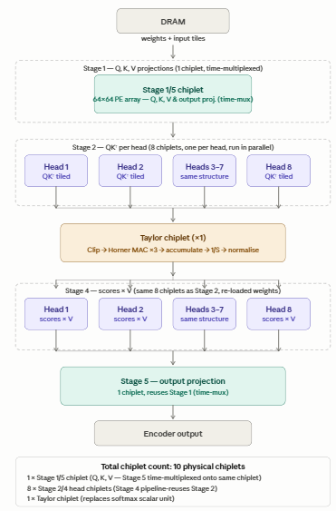

# INSTRUCTIONS
- How to run the code
- Versions and dependencies while running the code
- Deviation from M1

### How to run the testbenches
**Run the interface file first**   
#Compiles the interface.sv file  
iverilog -g2012 -Wall -o sim_interface.vvp interface.sv  

#This line removes the simulation folder created form a previous run  
rm -rf sim_build  

#Use the makefile with the tb_interface and gives an output in interface_run.log file  
make -f Makefile.interface SIM=icarus 2>&1 | tee interface_run.log  

#display the waveform using gtkwave  
gtkwave sim_build/axi_if.fst

**Run the compute_core file next**   
#Compiles the compute_core.sv file   
iverilog -g2012 -Wall -o sim_compute_core.vvp soc_top_stubs.sv interface.sv compute_core.sv  

#This line removes the simulation folder created form a previous run     
rm -rf sim_build  

#Use the makefile with the tb_compute_core and gives an output in compute_core_run.log file  
make -f Makefile.compute_core SIM=icarus 2>&1 | tee compute_core_run.log

#display the waveform using gtkwave  
gtkwave sim_build/soc_top.fst

### Versions and dependencies while running the code

**RTL Simulation**  
- gcc (Ubuntu 13.3.0-6ubuntu2~24.04.1) 
- Icarus Verilog version 12.0
- GTKWave Analyzer v3.3.116 

**Testbench Simulation**
- Python 3.12.3 
- numpy 2.4.4

### Deviation from M1
- Hardware accelerator in M1 for a single chip. This deisgn breaks it up to 10 chiplets.
- The internal communication within the chiplets communicate is using UCIe link.
- The 9th chiplet used taylor approximation instead of using softmax function.
- The precision used in the hardware accelerator is BF16 instead of FP32.

Below is the block level diagram for the chiplet design  
 
