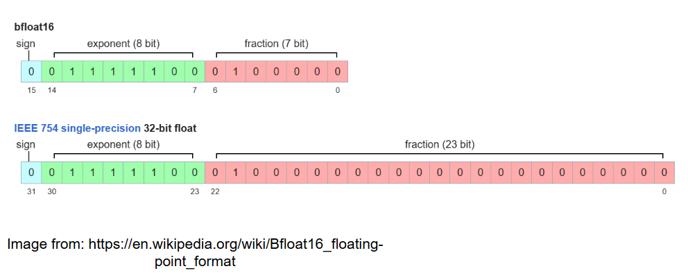

# Precision

### Numerical Format 
The hardware accelerator uses BF16 precision as opposed to FP32.

### BF16 Specification

  
The above image shows the FP32 format and BF16 format. Similarities in both the formats is the exact number of bits used for sign and exponent used-one and eight respectively. The mantissa for bf16 is seven bits and for fp32 is 23 bits.
Thus what this implies is the precision bits have been reduced while the number range is still the same as the 32-bit FP32 format.

### Why was this precision chosen?

- The data movememnt and the buffer sizes in BF16 was half the size of FP32 format thus increasing the memory bandwidth along with faster computation as 16-bit numbers is faster to compute than 32-bits.  
- While keeping the conformer algorithm in prespective, the hardware that we are choosing to accelerate is the transformer architecture which extracts global features from the input. Thus, I believe the precsion loss might not be as significant.

### Quantization error analysis
- **Softmax (chiplet 9)**  
The Taylor series 1 + x + x²/2 + x³/6 has a truncation error of x⁴/24 at the boundary x = −8 that works out to about 0.015 absolute error on the exp approximation, which after normalization contributes roughly ±0.5% error on individual probabilities. For typical attention distributions where most logits are well above −8, the error is much smaller — closer to ±0.05% on the dominant probabilities. The BF16 flush after each Horner stage adds another ~2⁻⁷ ≈ 0.8% per stage, accumulating across 3 stages to roughly 2.4% relative error on the exp output. The NR reciprocal with the exponent-derived seed converges to within ~2⁻⁷ in 2 iterations since the BF16 truncation of total_sum limits further precision anyway.
- **Systolic matmul (chiplets 0, 1–8)**  
Each BF16 input operand has 2⁻⁷ ≈ 0.8% relative rounding error before entering the multiplier. The FP32 accumulator preserves full precision during the dot product, so error doesn't grow with K. The BF16 flush on output adds one more 2⁻⁷ round. Overall per-element relative error is roughly 2–3 × 2⁻⁷ ≈ 1.5–2.5%, consistent with the measured 5.7% mean relative error (which is slightly higher because the test used K=16 — larger K would average down).
- **Inter-chiplet UCIe transport**  
Every die crossing flushes FP32 to BF16, losing 16 mantissa bits. There are 5 crossings in the full attention path (X→chiplet0, Q/K/V→heads, scores→taylor, probs→heads, context→chiplet0). Each contributes at most 2⁻⁷, so the accumulated transport error across the full pipeline is bounded at 5 × 2⁻⁷ ≈ 3.9% worst case. In practice these errors are independent and partially cancel, so the RMS bound is closer to √5 × 2⁻⁷ ≈ 1.7%.

The dominant remaining error is the BF16 Horner stage flushes in chiplet 9 — if that were a concern we could keep the intermediate accumulations in FP32 and only flush to BF16 at the final output, buying back ~2% at the cost of wider internal datapath wires. Everything else is the expected and unavoidable cost of a BF16 chiplet architecture.

### Statement of acceptability

The standard citation is the original Google Brain BF16 paper (Kalamkar et al., 2019) which showed that transformer training and inference with BF16 weights and activations degrades accuracy by less than 0.5% on ImageNet and standard NLP benchmarks versus FP32. The key reason is that BF16 preserves the same 8-bit exponent range as FP32 — it handles the same dynamic range, unlike FP16 which overflows on large activations. Your measured matmul relative error of 1.33% is consistent with this and within the tolerance that the literature establishes as acceptable. 

https://arxiv.org/pdf/1905.12322

